# 482-Group-Project
Inertia Pendulum

  

California State University, Chico

Fall 2021, MECA482-01-7534 Control System Design

Instructor: Dr. Hasan Sinan Bank

Project Members: Jerome Lee, Austin Mahannah, Craig Parks, Melania Raygoza

## Table of Contents
1. Introduction 
2. Modeling
3. Sensor Calibration
4. Control Design and Simulations
5. Simulation
6. References

## 1. Introduction 
The Inertia Wheel Pendulum (IWP) principle of operation is a rotational electromechanical system is fixed with a inertial mass at the end of the a 1 degree-of-freedom rotational pendulum. The IWP will consist of a Link, mounted to a rigid surface, with a wheel at the end of that link that will be driven a motor to utilize the mass and geometric properties of the wheel to swing the link into the upright position. As the motor spins the wheel, this will create a reaction in the link to begin swinging, as a pendulum, with a controlled input to the system to provide sufficient angular acceleration and velocity to create enough momentum to swing the pendulum in the upright position.                                                                                

  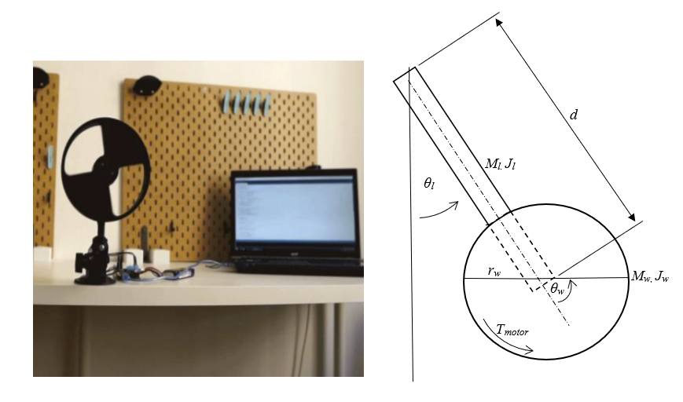

## 2. Modeling
>Logical Viewpoint:

  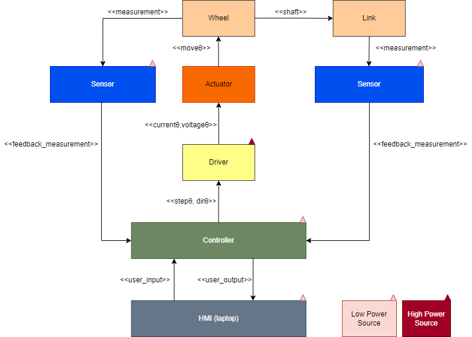

                                                                                       
>Functional Viewpoint:

  

Nomenclature:

  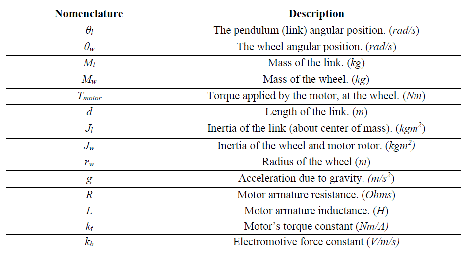

>Calculations:
                                                                                  
The mathematical model for the IWP will be derived using the Euler-Lagrange equations (Eq. 1&2) to demonstrate the interacting bodies as a second-order ordinary differential equation.

  

The “L” term will be determined by an analysis of both the kinetic energies and potential energies from both the wheel and link. The difference of the summed kinetic energies and potential energies from both bodies will give us the Lagrangian as shown in Eq. 2, 3, and 4.

  

The kinetic energy seen at the link is based on the geometric properties, and mass, of the link as a function of the change in angle when the system accelerates. This can be viewed as a rectangular extrusion with a given mass Ml as well as the energy it takes it to rotate about its center of mass.
 

  

 
The kinetic energy at the wheel can be achieved by a similar process, although, the angle of the wheel will be affected by the angle of the link which can be calculated by the sum of the 2.
 

  

 
The potential energy equations can be formed under the assumption that the angle, θl, is in a rested position and both potential energies will equate to 0. The pendulum should only gain potential energy as the pendulum begins swinging to a position and certain height, where the kinetic is transferred to potential energy after, and just before, the pendulum swings back down when the acceleration and velocity is at 0.
 

  

  
Thus, given the Euler-Lagrange equations stated in the beginning, the Lagrangian can be viewed and constructed as:

  

  
After plugging in the “L” term to Eq. 1 & 2, and a bit of rearranging, we can view the equation in matrix form.
 

  

To verify that the inverse of the matrix exists (which is needed to find the solution of linear equations), it is necessary to take the determinant of the D matrix and confirm that the solution is NOT equal to 0.
Once confirmed, we can define our state vectors as such:

  

From Eq.#, we can take the inverse of our D matrix:
 

  

After taking the inverse of the D matrix formed from the original Lagrangian, in Eq.#, we can represent the state vector model in the form of its derivative as shown:      
 

  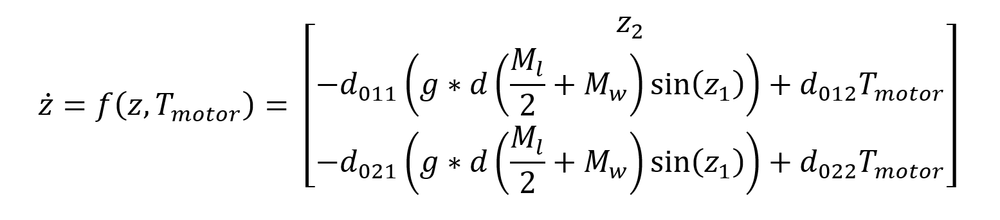

The state space model can be approximated in the form of a linear representation as:

  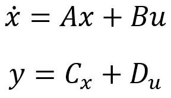

Where A and B, and C are represented as:

  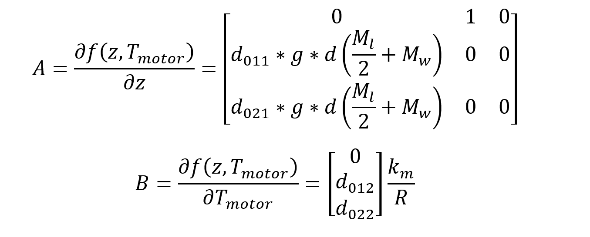

 

  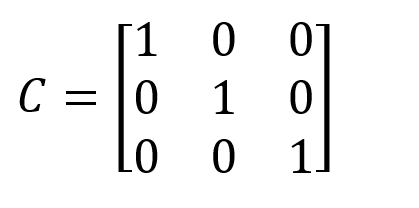

        
To verify that the system is controllable, we take the determinant of the controllability matrix, C, and verify that the determinant is NOT equal to 0.

## 3. Sensor Calibration
For the Inertia Pendulum, the main contributing factor to its operation is the angle of the lever arm, as the control system seeks to make it vertical. This project only has one degree of freedom; with only a single axis, the value of the angle is measured through the encoder. This reading will determine the amount of input required by the controller to react to the changing positions of the wheel, eventually reaching its goal of becoming vertical.

## 4. Control Design and Simulations
Controller design, Matlab to Coppelliasim:

## 5. References
Hernández-Guzmán, Victor Manuel, and Ramón Silva-Ortigoza. (2019). Automatic control with experiments. Cham, Switzerland: Springer.  
                                                                                    
Nise, Norman S. (2015). “Control Systems Engineering” Seventh Ed. Wiley.

## 6. Appendix
-Simulink Diagram :

  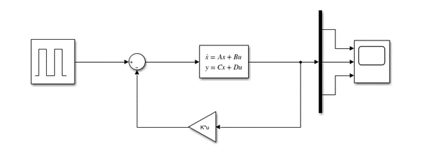

CAD Model:
                                                                          
  Front:

  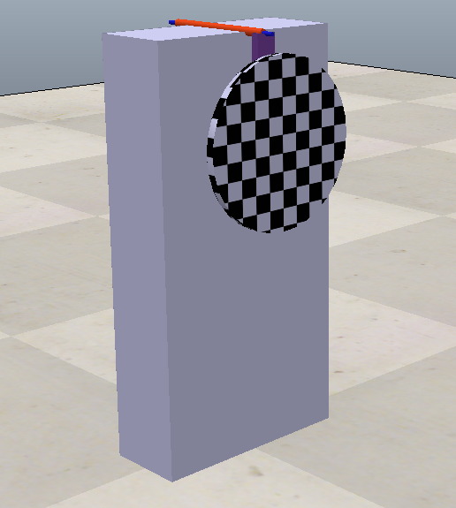

  Side:

  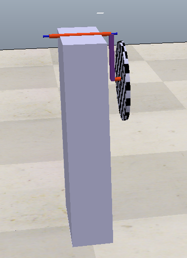

                                                                       
MATLAB Code:

  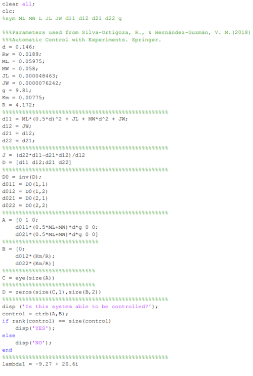

  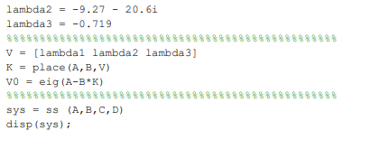

                                                                          
Results:

  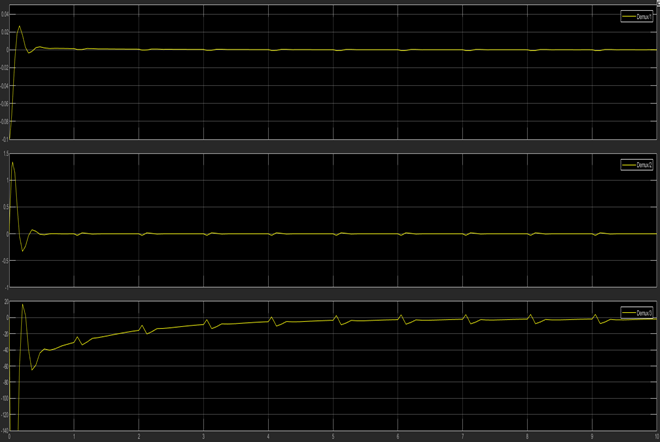

