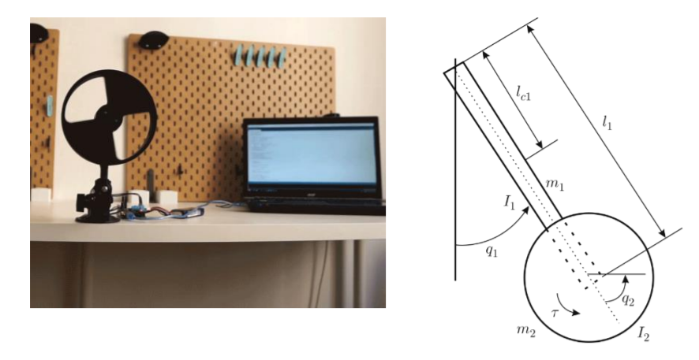
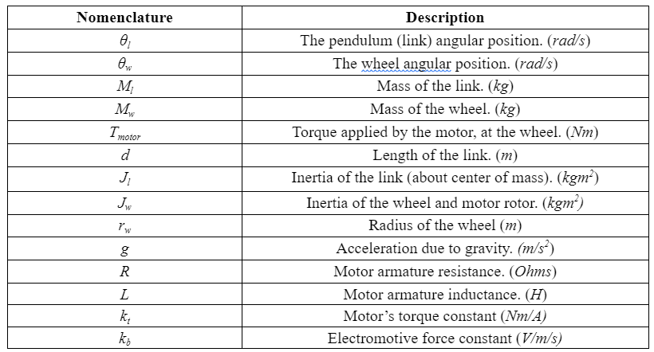
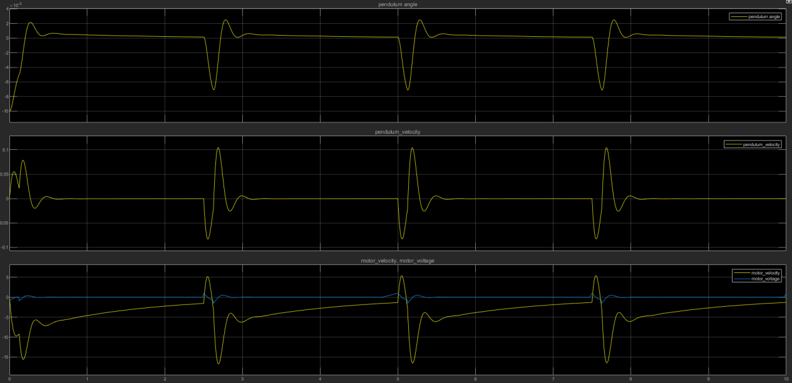

# 482-Group-Project
Inertia Pendulum

  

California State University, Chico

Fall 2021, MECA482-01-7534 Control System Design

Instructor: Dr. Hasan Sinan Bank

Project Members: Sarah Catching, Jerome Lee, Austin Mahannah, Craig Parks, Melania Raygoza

## Table of Contents
1. Introduction 
2. Modeling
3. Sensor Calibration
4. Control Design and Simulations
5. Simulation
6. References

## 1. Introduction 
The Furuta Pendulum, a rotational inverted pendulum, consists of a driven arm which rotates in the
horizontal plane and a pendulum attached to said arm which is free to rotate in the vertical plane. It was
invented in 1992 at the Tokyo Institute of Technology by Katsuhisa Furuta and his colleagues. The
team used this project to investigate the creation of a test platform for control system
algorithms in a low-cost and streamlined fashion. In that regard, the project team is expected to create
a mathematical model of the system with a designed control system.                                                                                 

  

## 2. Modeling
>Logical Viewpoint:

  

                                                                                       
>Functional Viewpoint:

  

Nomenclature:

  

>Calculations:
                                                                                  
The mathematical model for the IWP will be derived using the Euler-Lagrange equations (Eq. 1&2) to demonstrate the interacting bodies as a second-order ordinary differential equation.

  

The “L” term will be determined by an analysis of both the kinetic energies and potential energies from both the wheel and link. The difference of the summed kinetic energies and potential energies from both bodies will give us the Lagrangian as shown in Eq. 2, 3, and 4.

  

 

  

                                                                                  
 

  

 

## 3. Sensor Calibration
For the Inertia Pendulum, the main contributing factor to its operation is the angle of the lever arm, as the control system seeks to make it vertical. This project only has one degree of freedom; with only a single axis, the value of the angle is measured through the encoder. This reading will determine the amount of input required by the controller to react to the changing positions of the wheel, eventually reaching its goal of becoming vertical.

## 4. Control Design and Simulations
Controller design, Matlab to Coppelliasim:

## 5. References
Hernández-Guzmán, Victor Manuel, and Ramón Silva-Ortigoza. (2019). Automatic control with experiments. Cham, Switzerland: Springer.  
                                                                                    
Nise, Norman S. (2015). “Control Systems Engineering” Seventh Ed. Wiley.

## 6. Appendix
-Simulink Diagram :

Coppeliasim Video: 

CAD Model:

MATLAB Code:

MatLab Results:

  

